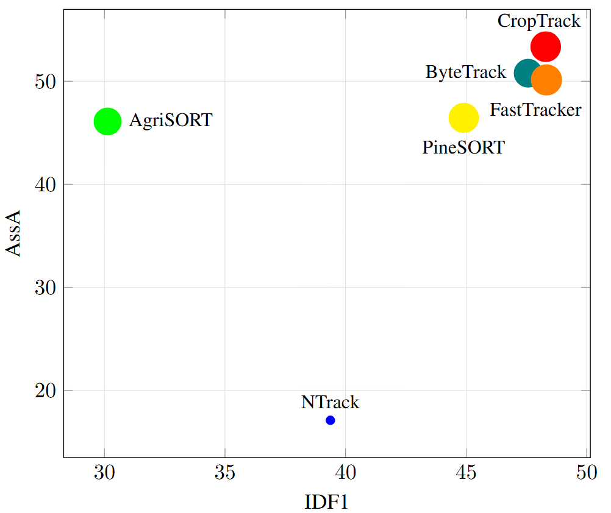

## CropTrack: A Tracking with Re-Identification Framework for Precision Agriculture


### Overview

Multi-object tracking (MOT) in agricultural environments presents major
challenges due to repetitive patterns, similar object appearances, sudden
illumination changes, and frequent occlusions. Contemporary trackers in this
domain rely on the motion of objects rather than appearance for association.
Nevertheless, they struggle to maintain object identities when targets undergo
frequent and strong occlusions. The high similarity of object appearances makes
integrating appearance-based association non-trivial for agricultural scenarios.

<p align="center">
  
</p>

To solve this problem we propose CropTrack, a MOT framework based on a
combination of appearance and motion information.
This repository provides source code for our ... titled "[CropTrack: A Tracking with Re-Identification Framework for Precision Agriculture
](...)." 
CropTrack integrates a
re-ranking–enhanced appearance association, a one-to-many association with
appearance-based conflict resolution strategy, and an exponential moving average
prototype feature bank to improve appearance-based association. Evaluated on
publicly available agricultural MOT datasets, CropTrack demonstrates consistent
identity preservation, outperforming traditional motion-based tracking methods.
Compared to the state of the art, CropTrack achieves significant gains in
identification F1 and association accuracy scores with a lower number of
identity switches. 

More information on the project can be found on the 
[CropTrack website](...).

### Citation

If you find this project useful, then please consider citing both our paper and
dataset.

```bibitex
@inproceedings{CropTrack,
  title={CropTrack: A Tracking with Re-Identification Framework for Precision Agriculture
},
  author={Al Muzaddid, Md Ahmed, Jordan A. James, and Beksi, William J},
  year={2026}
}
```

### CropTrack Pipeline 

<p align="center">
  
</p>

### Installation 

First, begin by cloning the project:

    $ git clone https://github.com/robotic-vision-lab/CropTrack-Tracking-with-Re-Identification.git
    $ cd CropTrack-Tracking-with-Re-Identification


### Dataset 

Download the TexCot22/AgriSORT-Grapes dataset files.


### Usage 

# Extract features
    $ python ...


# Tracking

    $ python ...
   
### CropTrack Source Code License

[](...)


