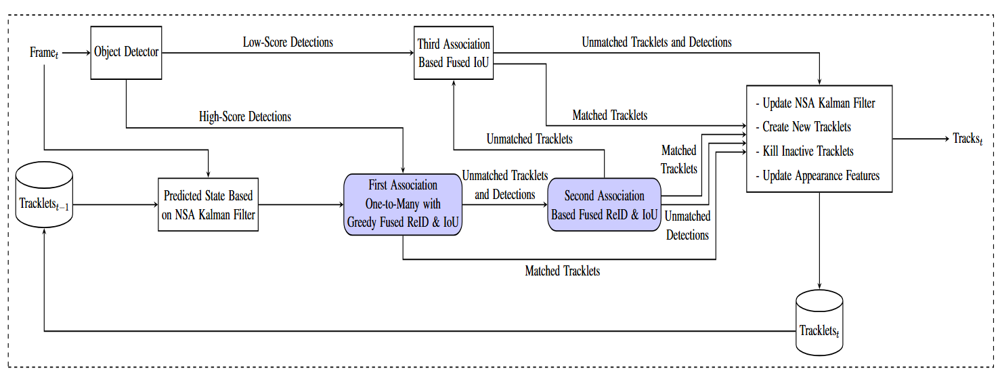

## CropTrack: A Tracking with Re-Identification Framework for Precision Agriculture

### Overview

Multi-object tracking (MOT) in agricultural environments presents major
challenges due to repetitive patterns, similar object appearances, sudden
illumination changes, and frequent occlusions. Contemporary trackers in this
domain rely on the motion of objects rather than appearance for association.
Nevertheless, they struggle to maintain object identities when targets undergo
frequent and strong occlusions. The high similarity of object appearances makes
integrating appearance-based association non-trivial for agricultural
scenarios.

<p align="center">
  
</p>

This repository provides source code for our paper titled "[CropTrack: A
Tracking with Re-Identification Framework for Precision Agriculture ]()."
CropTrack is a MOT framework based on a combination of appearance and motion
information. Concretely, CropTrack integrates a reranking-enhanced appearance
association, a one-to-many association with appearance-based conflict
resolution strategy, and an exponential moving average prototype feature bank
to improve appearance-based association. Evaluated on publicly available
agricultural MOT datasets, CropTrack demonstrates consistent identity
preservation, outperforming traditional motion-based tracking methods.
Compared to the state of the art, CropTrack achieves significant gains in
identification F1 and association accuracy scores with a lower number of
identity switches. 

More information on the project can be found on the [CropTrack
website](https://robotic-vision-lab.github.io/croptrack).

### Citation

If you find this project useful, then please consider citing our paper.

```bibitex
@article{muzaddid2025crop,
  title={CropTrack: A tracking with re-identification framework for precision agriculture},
  author={Al Muzaddid, Md Ahmed and James, Jordan A and Beksi, William J},
  journal={arXiv preprint arXiv:2512.24838},
  year={2025}
}
```

### CropTrack Pipeline 

<p align="center">
  
</p>

### Installation 

First, begin by cloning the project

    $ git clone https://github.com/robotic-vision-lab/CropTrack-A-Tracking-With-Re-Identification-Framework
    $ cd CropTrack-A-Tracking-With-Re-Identification-Framework

Next, create an environment and install the dependencies

    $ conda create --name croptrack python=3.10.
    $ conda activate croptrack
    $ pip install -r requirements.txt

### Datasets 

Download the
[TexCot22](https://dataverse.tdl.org/dataset.xhtml?persistentId=doi:10.18738/T8/5M9NCI)
and
[AgriSORT-Grapes](https://drive.google.com/drive/folders/1sbsUwCtGQtA58cLVP5sd37tjjkMFCh05)
dataset files and place the public detections in their corresponding sequence
folders.

### Usage 

#### Feature Extraction 

The [PHA](https://github.com/zhangguiwei610/PHA) model is used for extracting
the appearance features. For reproducibility, we provide the detections used
for all the experiments.

#### Object Tracking

To run the tracker, execute the following command

    $ python run_tracker.py \
    --data_dir "D:\TexCot22\test" \
    --dataset_type cotton \
    --alpha [0.5, 0.9, 0.1] \
    --track_thresh 0.6 \
    --track_buffer 30 \
    --match_thresh 0.875 \
    --min-box-area 100
   
### License

[](https://github.com/robotic-vision-lab/CropTrack-A-Tracking-With-Re-Identification-Framework/blob/main/LICENSE)
